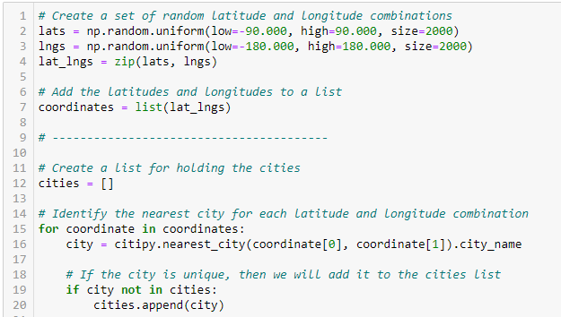
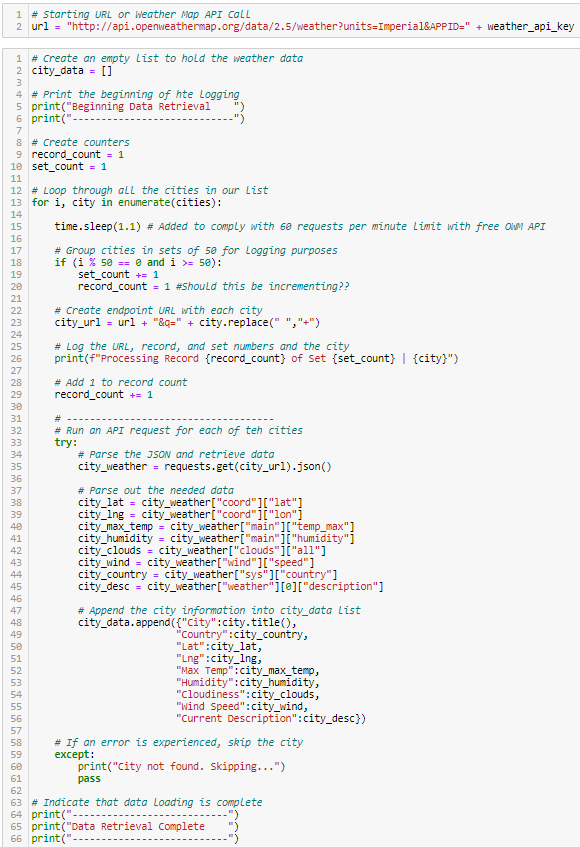
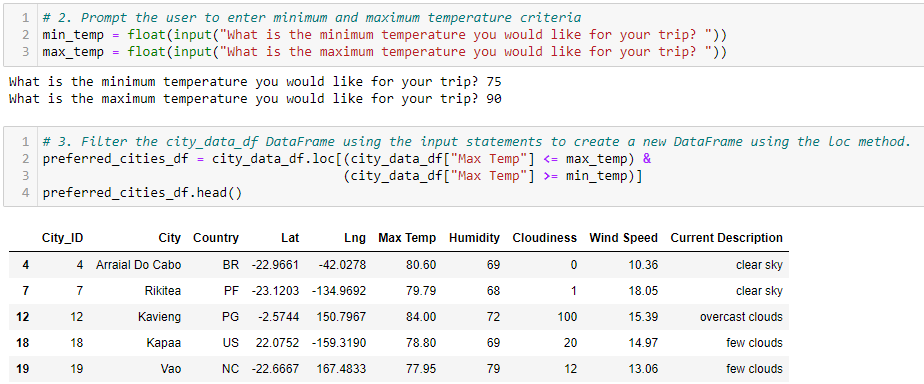
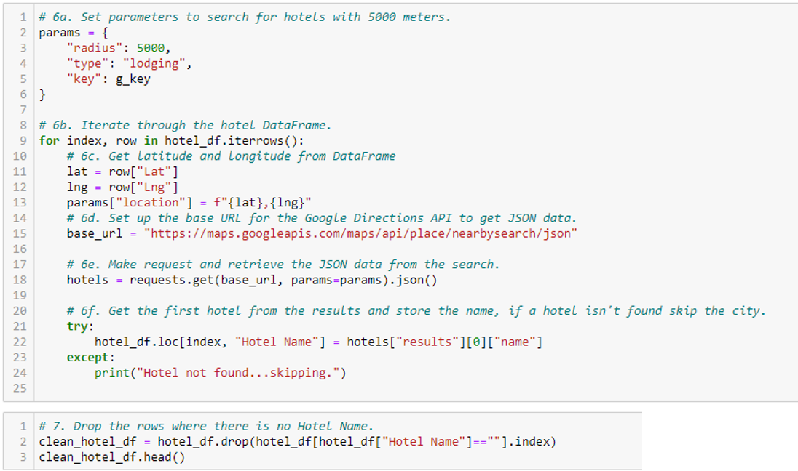
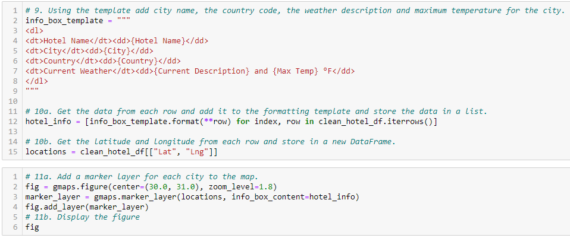
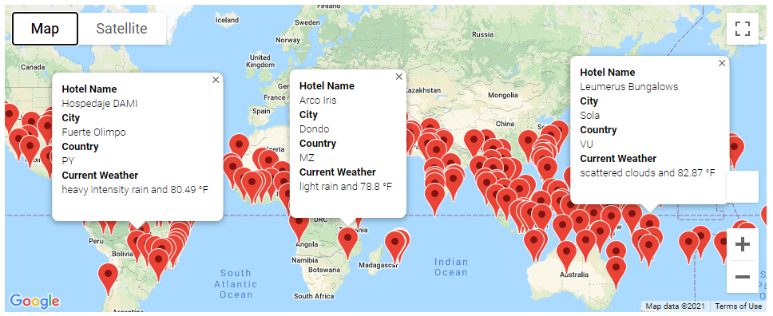
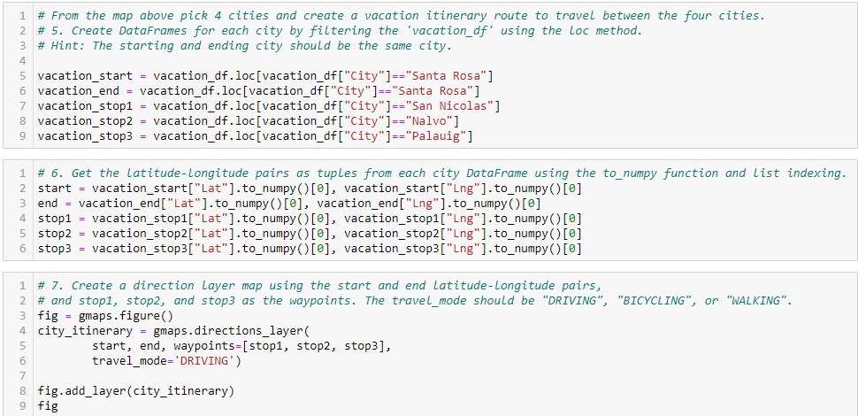
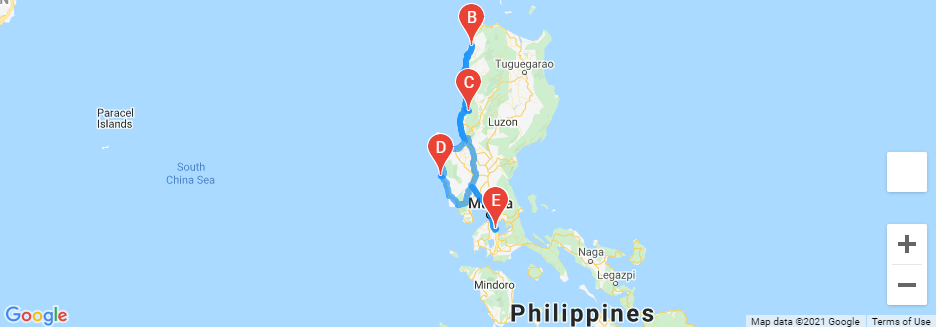
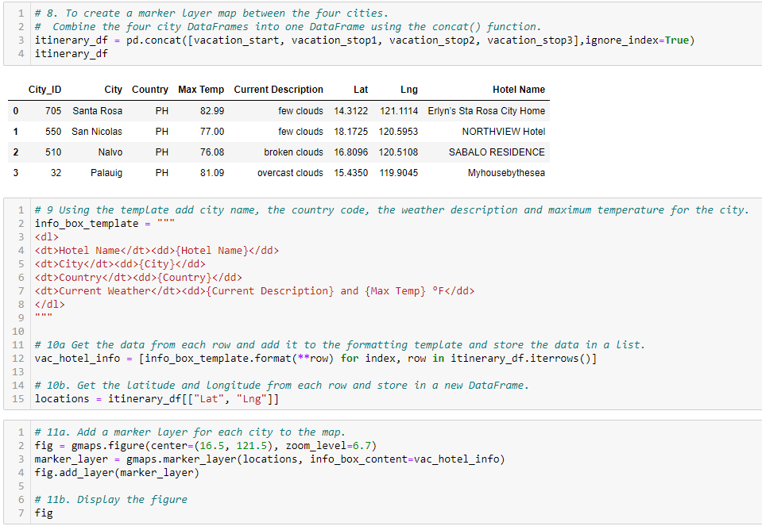
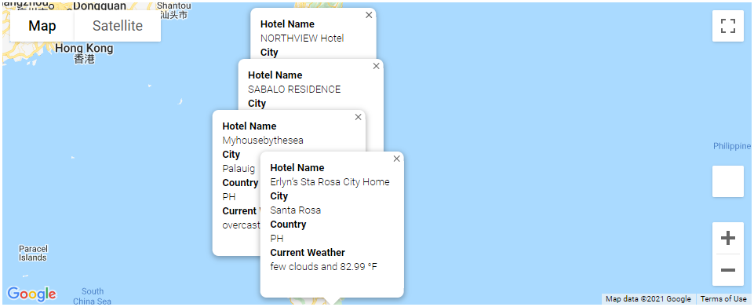

# World Weather Analysis

## World Weather Analysis Overview

This project incorporated API calls in Python to develop a travel itinerary. Random latitudes and longitudes were generated, and the nearest city to those coordinates was extracted using the citipy module. API calls were used to collect weather data for each city from the OpenWeather website (https://openweathermap.org/). The cities were downselected based on the user's preference for minimum and maximum temperature by requesting input from the user. The gmaps plugin and API calls to Google maps were then used to find hotels in each city and plot the cities on a map. Four cities were selected for a potential trip, and travel directions were plotted using the directions API in Google maps. The code for this project was developed in Jupyter Notebook using Python version 3.8.8.

## World Weather Analysis Results

Initially, 2000 latitudes and longitudes were generated randomly, and the citipy module was used to find the nearest city to each latitude/longitude pair. The code used to perform this operation is shown in Fig. 1.

*Figure 1. Python code to generate coordinates and find cities*

After finding the cities associated with latitude/longitude pairs, the OpenWeather website was used to find the weather for each city using the code shown in Fig. 2. Notice the 'time.sleep(1.1)' code on line 15 of the second code block of Fig. 2. This effectively implemented a 1.1-second delay between each successive code run to comply with the 60 requests per minute (rpm) restriction for the free OpenWeather account.

*Figure 2. Python code to find city weather data from OpenWeather website*

After generating the list of cities, the user was prompted to enter the desired minimum and maximum temperatures for his or her trip. These inputs were used to narrow the list of cities to those with minimum and maximum temperatures that met the user's specifications. This code is shown in Fig. 3.

*Figure 3. Python code to prompt user for min/max temperature and narrow cities based on user input*

From there, Google maps API calls were used to find hotels in each of the potential cities narrowed by the previous step, and the data set was cleaned to remove cities where no hotels were found. This code is shown in Fig. 4.

*Figure 4. Python code to find hotels in the downselected cities and remove cities where no hotels were found*

The hotels were then plotted using Google maps with pop-ups for each hotel to provide the name of the hotel, the city, the country, and weather conditions. This code is shown in Fig. 5, and the resulting map is shown in Fig. 6.

*Figure 5. Python code to plot hotels on a Google map with markers*

*Figure 6. Google map of potential hotels indicated by markers with pop-ups*

A travel itinerary was then put together for four cities within the same country. In this case, four cities in the Philippines were chosen for a road trip. The starting city was Santa Rosa with additional stops planned in San Nicolas, Nalvo, and Palauig. The travel directions were plotted using the Directions API in Google maps. The code to generate the directions is shown in Fig. 7, and the resulting map is shown in Fig. 8.

*Figure 7. Python code to generate directions for a driving trip to four cities in the Philippines*

*Figure 8. Google map with driving directions to selected cities in the Philippines*

The individual data frams for each city were then combined into a single data frame, and the coordinates with markers were plotted on a map. The code for this is shown in Fig. 9, and the map is shown in Fig. 10.

*Figure 9. Python code to concatenate individual city data frames and plot cities on a map with markers*

*Figure 8. Google map for hotels in four selected cities in the Philippines with markers*

## World Weather Analysis Summary

This project familiarized students with API requests and responses, specifically those related to weather and travel applications. The code developed in this module could provide the foundation for travel application development.